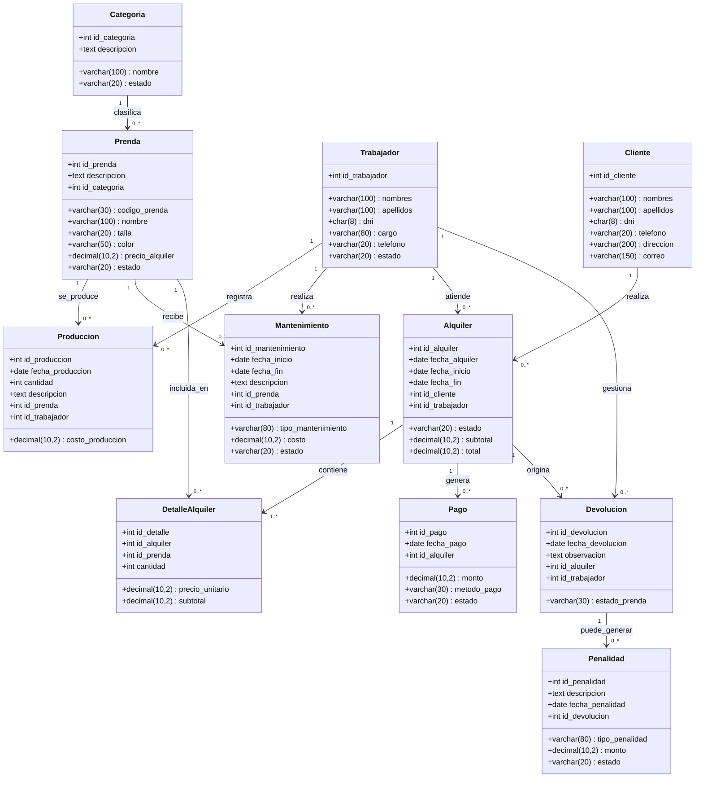

# Diagrama de Clases - Sistema de Alquiler de Prendas

```mermaid
classDiagram
    class Categoria {
        +int id_categoria
        +varchar(100) nombre
        +text descripcion
        +varchar(20) estado
    }

    class Prenda {
        +int id_prenda
        +varchar(30) codigo_prenda
        +varchar(100) nombre
        +text descripcion
        +varchar(20) talla
        +varchar(50) color
        +decimal(10,2) precio_alquiler
        +varchar(20) estado
        +int id_categoria
    }

    class Trabajador {
        +int id_trabajador
        +varchar(100) nombres
        +varchar(100) apellidos
        +char(8) dni
        +varchar(80) cargo
        +varchar(20) telefono
        +varchar(20) estado
    }

    class Cliente {
        +int id_cliente
        +varchar(100) nombres
        +varchar(100) apellidos
        +char(8) dni
        +varchar(20) telefono
        +varchar(200) direccion
        +varchar(150) correo
    }

    class Produccion {
        +int id_produccion
        +date fecha_produccion
        +int cantidad
        +decimal(10,2) costo_produccion
        +text descripcion
        +int id_prenda
        +int id_trabajador
    }

    class Mantenimiento {
        +int id_mantenimiento
        +date fecha_inicio
        +date fecha_fin
        +varchar(80) tipo_mantenimiento
        +text descripcion
        +decimal(10,2) costo
        +varchar(20) estado
        +int id_prenda
        +int id_trabajador
    }

    class Alquiler {
        +int id_alquiler
        +date fecha_alquiler
        +date fecha_inicio
        +date fecha_fin
        +varchar(20) estado
        +decimal(10,2) subtotal
        +decimal(10,2) total
        +int id_cliente
        +int id_trabajador
    }

    class DetalleAlquiler {
        +int id_detalle
        +int id_alquiler
        +int id_prenda
        +int cantidad
        +decimal(10,2) precio_unitario
        +decimal(10,2) subtotal
    }

    class Pago {
        +int id_pago
        +date fecha_pago
        +decimal(10,2) monto
        +varchar(30) metodo_pago
        +varchar(20) estado
        +int id_alquiler
    }

    class Devolucion {
        +int id_devolucion
        +date fecha_devolucion
        +varchar(30) estado_prenda
        +text observacion
        +int id_alquiler
        +int id_trabajador
    }

    class Penalidad {
        +int id_penalidad
        +varchar(80) tipo_penalidad
        +text descripcion
        +decimal(10,2) monto
        +date fecha_penalidad
        +varchar(20) estado
        +int id_devolucion
    }

    Categoria "1" --> "0..*" Prenda : clasifica
    Prenda "1" --> "0..*" Produccion : se_produce
    Trabajador "1" --> "0..*" Produccion : registra
    Prenda "1" --> "0..*" Mantenimiento : recibe
    Trabajador "1" --> "0..*" Mantenimiento : realiza
    Trabajador "1" --> "0..*" Alquiler : atiende
    Cliente "1" --> "0..*" Alquiler : realiza
    Alquiler "1" --> "1..*" DetalleAlquiler : contiene
    Prenda "1" --> "0..*" DetalleAlquiler : incluida_en
    Alquiler "1" --> "0..*" Pago : genera
    Alquiler "1" --> "0..*" Devolucion : origina
    Trabajador "1" --> "0..*" Devolucion : gestiona
    Devolucion "1" --> "0..*" Penalidad : puede_generar
```
