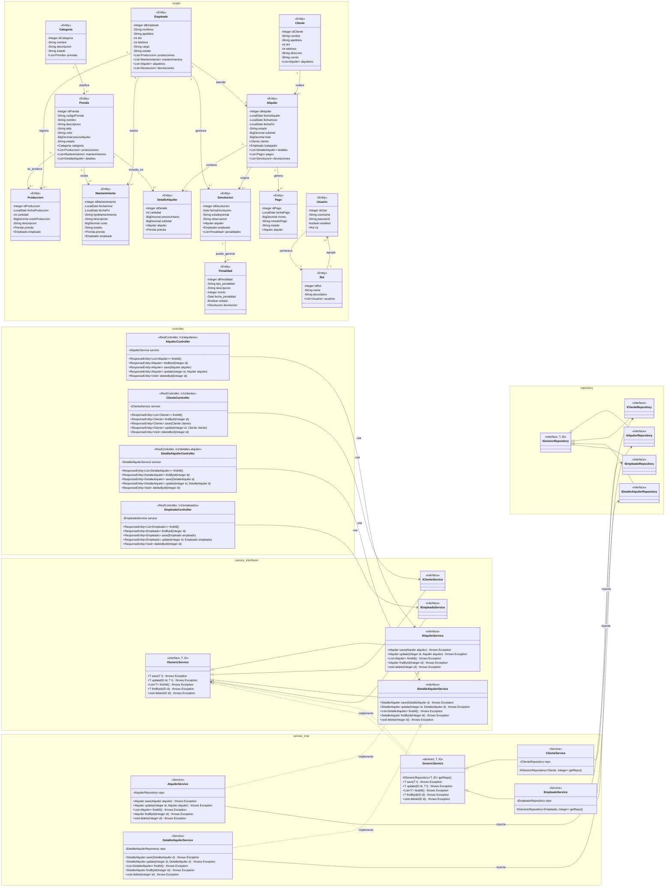

# Diagrama de Clases y Métodos - Sistema de Alquiler de Prendas

Diagrama generado a partir del análisis del proyecto real (Spring Boot, arquitectura en capas).

```mermaid
classDiagram
    direction LR

    %% ==================== CAPA MODELO (Entidades JPA) ====================
    namespace model {
        class Categoria {
            <<Entity>>
            -Integer idCategoria
            -String nombre
            -String descripcion
            -String estado
            +List~Prenda~ prendas
        }

        class Prenda {
            <<Entity>>
            -Integer idPrenda
            -String codigoPrenda
            -String nombre
            -String descripcion
            -String talla
            -String color
            -BigDecimal precioAlquiler
            -String estado
            +Categoria categoria
            +List~Produccion~ producciones
            +List~Mantenimiento~ mantenimientos
            +List~DetalleAlquiler~ detalles
        }

        class Produccion {
            <<Entity>>
            -Integer idProduccion
            -LocalDate fechaProduccion
            -int cantidad
            -BigDecimal costoProduccion
            -String descripcion
            +Prenda prenda
            +Empleado empleado
        }

        class Mantenimiento {
            <<Entity>>
            -Integer idMantenimiento
            -LocalDate fechaInicio
            -LocalDate fechaFin
            -String tipoMantenimiento
            -String descripcion
            -BigDecimal costo
            -String estado
            +Prenda prenda
            +Empleado empleado
        }

        class Empleado {
            <<Entity>>
            -Integer idEmpleado
            -String nombres
            -String apellidos
            -int dni
            -int telefono
            -String cargo
            -String estado
            +List~Produccion~ producciones
            +List~Mantenimiento~ mantenimientos
            +List~Alquiler~ alquileres
            +List~Devolucion~ devoluciones
        }

        class Cliente {
            <<Entity>>
            -Integer idCliente
            -String nombre
            -String apellidos
            -int dni
            -int telefono
            -String direccion
            -String correo
            +List~Alquiler~ alquileres
        }

        class Alquiler {
            <<Entity>>
            -Integer idAlquiler
            -LocalDate fechaAlquiler
            -LocalDate fechaInicio
            -LocalDate fechaFin
            -String estado
            -BigDecimal subtotal
            -BigDecimal total
            +Cliente cliente
            +Empleado trabajador
            +List~DetalleAlquiler~ detalles
            +List~Pago~ pagos
            +List~Devolucion~ devoluciones
        }

        class DetalleAlquiler {
            <<Entity>>
            -Integer idDetalle
            -int cantidad
            -BigDecimal precioUnitario
            -BigDecimal subtotal
            +Alquiler alquiler
            +Prenda prenda
        }

        class Pago {
            <<Entity>>
            -Integer idPago
            -LocalDate fechaPago
            -BigDecimal monto
            -String metodoPago
            -String estado
            +Alquiler alquiler
        }

        class Devolucion {
            <<Entity>>
            -Integer idDevolucion
            -Date fechaDevolucion
            -String estadoprenda
            -String observacion
            +Alquiler alquiler
            +Empleado empleado
            +List~Penalidad~ penalidades
        }

        class Penalidad {
            <<Entity>>
            -Integer idPenalidad
            -String tipo_penalidad
            -String descripcion
            -Integer monto
            -Date fecha_penalidad
            -Boolean estado
            +Devolucion devolucion
        }

        class Usuario {
            <<Entity>>
            -Integer idUser
            -String username
            -String password
            -boolean enabled
            +Rol rol
        }

        class Rol {
            <<Entity>>
            -Integer idRol
            -String name
            -String description
            +List~Usuario~ usuarios
        }
    }

    %% ==================== CAPA REPOSITORIO ====================
    namespace repository {
        class IGenericRepository {
            <<interface, T, ID>>
        }

        class IAlquilerRepository {
            <<interface>>
        }

        class IClienteRepository {
            <<interface>>
        }

        class IDetalleAlquilerRepository {
            <<interface>>
        }

        class IEmpleadoRepository {
            <<interface>>
        }
    }

    %% ==================== CAPA SERVICIO (interfaces) ====================
    namespace service_interfaces {
        class IGenericService {
            <<interface, T, ID>>
            +T save(T t) throws Exception
            +T update(ID id, T t) throws Exception
            +List~T~ findAll() throws Exception
            +T findById(ID id) throws Exception
            +void delete(ID id) throws Exception
        }

        class IAlquilerService {
            <<interface>>
            +Alquiler save(Alquiler alquiler) throws Exception
            +Alquiler update(Integer id, Alquiler alquiler) throws Exception
            +List~Alquiler~ findAll() throws Exception
            +Alquiler findById(Integer id) throws Exception
            +void delete(Integer id) throws Exception
        }

        class IClienteService {
            <<interface>>
        }

        class IDetalleAlquilerService {
            <<interface>>
            +DetalleAlquiler save(DetalleAlquiler d) throws Exception
            +DetalleAlquiler update(Integer id, DetalleAlquiler d) throws Exception
            +List~DetalleAlquiler~ findAll() throws Exception
            +DetalleAlquiler findById(Integer id) throws Exception
            +void delete(Integer id) throws Exception
        }

        class IEmpleadoService {
            <<interface>>
        }
    }

    %% ==================== CAPA SERVICIO (implementaciones) ====================
    namespace service_impl {
        class GenericService {
            <<abstract, T, ID>>
            #IGenericRepository~T, ID~ getRepo()
            +T save(T t) throws Exception
            +T update(ID id, T t) throws Exception
            +List~T~ findAll() throws Exception
            +T findById(ID id) throws Exception
            +void delete(ID id) throws Exception
        }

        class AlquilerService {
            <<Service>>
            -IAlquilerRepository repo
            +Alquiler save(Alquiler alquiler) throws Exception
            +Alquiler update(Integer id, Alquiler alquiler) throws Exception
            +List~Alquiler~ findAll() throws Exception
            +Alquiler findById(Integer id) throws Exception
            +void delete(Integer id) throws Exception
        }

        class ClienteService {
            <<Service>>
            -IClienteRepository repo
            #IGenericRepository~Cliente, Integer~ getRepo()
        }

        class DetalleAlquilerService {
            <<Service>>
            -IDetalleAlquilerRepository repo
            +DetalleAlquiler save(DetalleAlquiler d) throws Exception
            +DetalleAlquiler update(Integer id, DetalleAlquiler d) throws Exception
            +List~DetalleAlquiler~ findAll() throws Exception
            +DetalleAlquiler findById(Integer id) throws Exception
            +void delete(Integer id) throws Exception
        }

        class EmpleadoService {
            <<Service>>
            -IEmpleadoRepository repo
            #IGenericRepository~Empleado, Integer~ getRepo()
        }
    }

    %% ==================== CAPA CONTROLADOR (REST) ====================
    namespace controller {
        class AlquilerController {
            <<RestController, /v1/alquileres>>
            -IAlquilerService service
            +ResponseEntity~List~Alquiler~~ findAll()
            +ResponseEntity~Alquiler~ findById(Integer id)
            +ResponseEntity~Alquiler~ save(Alquiler alquiler)
            +ResponseEntity~Alquiler~ update(Integer id, Alquiler alquiler)
            +ResponseEntity~Void~ deleteById(Integer id)
        }

        class ClienteController {
            <<RestController, /v1/clientes>>
            -IClienteService service
            +ResponseEntity~List~Cliente~~ findAll()
            +ResponseEntity~Cliente~ findById(Integer id)
            +ResponseEntity~Cliente~ save(Cliente cliente)
            +ResponseEntity~Cliente~ update(Integer id, Cliente cliente)
            +ResponseEntity~Void~ deleteById(Integer id)
        }

        class DetalleAlquilerController {
            <<RestController, /v1/detalles-alquiler>>
            -IDetalleAlquilerService service
            +ResponseEntity~List~DetalleAlquiler~~ findAll()
            +ResponseEntity~DetalleAlquiler~ findById(Integer id)
            +ResponseEntity~DetalleAlquiler~ save(DetalleAlquiler d)
            +ResponseEntity~DetalleAlquiler~ update(Integer id, DetalleAlquiler d)
            +ResponseEntity~Void~ deleteById(Integer id)
        }

        class EmpleadoController {
            <<RestController, /v1/empleados>>
            -IEmpleadoService service
            +ResponseEntity~List~Empleado~~ findAll()
            +ResponseEntity~Empleado~ findById(Integer id)
            +ResponseEntity~Empleado~ save(Empleado empleado)
            +ResponseEntity~Empleado~ update(Integer id, Empleado empleado)
            +ResponseEntity~Void~ deleteById(Integer id)
        }
    }

    %% ==================== RELACIONES DE LAS ENTIDADES ====================
    Categoria "1" --> "0..*" Prenda : clasifica
    Prenda "1" --> "0..*" Produccion : se_produce
    Prenda "1" --> "0..*" Mantenimiento : recibe
    Prenda "1" --> "0..*" DetalleAlquiler : incluida_en
    Empleado "1" --> "0..*" Produccion : registra
    Empleado "1" --> "0..*" Mantenimiento : realiza
    Empleado "1" --> "0..*" Alquiler : atiende
    Empleado "1" --> "0..*" Devolucion : gestiona
    Cliente "1" --> "0..*" Alquiler : realiza
    Alquiler "1" --> "1..*" DetalleAlquiler : contiene
    Alquiler "1" --> "0..*" Pago : genera
    Alquiler "1" --> "0..*" Devolucion : origina
    Devolucion "1" --> "0..*" Penalidad : puede_generar
    Usuario "*" --> "1" Rol : pertenece
    Rol "1" --> "0..*" Usuario : agrupa

    %% ==================== RELACIONES DE LA ARQUITECTURA ====================
    IGenericRepository <|-- IAlquilerRepository
    IGenericRepository <|-- IClienteRepository
    IGenericRepository <|-- IDetalleAlquilerRepository
    IGenericRepository <|-- IEmpleadoRepository

    IGenericService <|-- IAlquilerService
    IGenericService <|-- IClienteService
    IGenericService <|-- IDetalleAlquilerService
    IGenericService <|-- IEmpleadoService

    GenericService ..|> IGenericService : implements
    IGenericService <.. GenericService
    GenericService <|-- ClienteService
    GenericService <|-- EmpleadoService
    AlquilerService ..|> IAlquilerService : implements
    DetalleAlquilerService ..|> IDetalleAlquilerService : implements

    AlquilerController --> IAlquilerService : usa
    ClienteController --> IClienteService : usa
    DetalleAlquilerController --> IDetalleAlquilerService : usa
    EmpleadoController --> IEmpleadoService : usa

    AlquilerService --> IAlquilerRepository : inyecta
    ClienteService --> IClienteRepository : inyecta
    DetalleAlquilerService --> IDetalleAlquilerRepository : inyecta
    EmpleadoService --> IEmpleadoRepository : inyecta
```